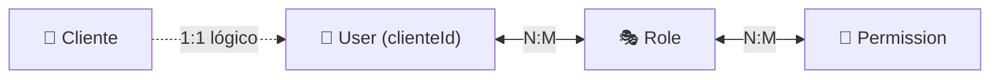
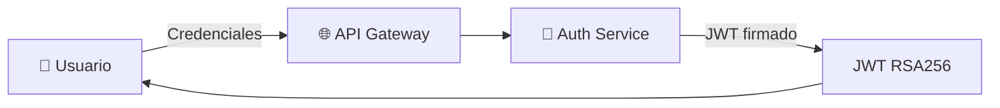
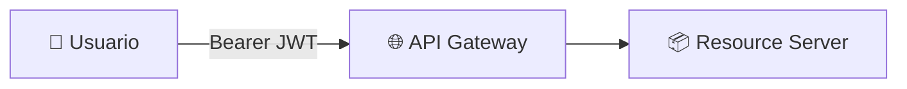
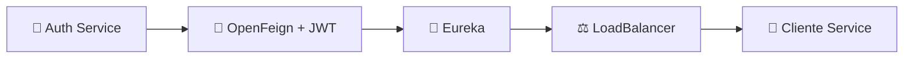

<div align="center">

# 🔐 Auth Service

### Microservicio de autenticación, autorización y gestión de identidades
#### ElectrodoStore · Spring Boot · JWT RSA256 · RBAC


</div>

---

Implementa seguridad basada en JWT firmado con RSA256, control de acceso RBAC y validación distribuida mediante OAuth2 Resource Server.

> ⚠️ El servicio no gestiona el dominio de negocio de clientes; solo mantiene su referencia lógica (`clienteId`).

---


## 🎯 Responsabilidades

- 🔑 Autenticación de usuarios
- 🪙 Emisión de JWT firmados con RSA256
- 👥 Gestión de usuarios, roles y permisos
- 🛡️ Control de acceso basado en RBAC
- 📋 Registro de identidad para usuarios con rol CLIENT
- 📡 Propagación de identidad vía JWT entre microservicios

---

## 🧰 Stack tecnológico


---

## 📦 Modelo de dominio



> El servicio de autenticación no administra la entidad Cliente, solo almacena su identificador como vínculo con el dominio de negocio.

---

## 🔐 Modelo de seguridad

### 🔑 Autenticación



**Flujo:**

1. El usuario envía sus credenciales al API Gateway
2. API Gateway redirige la solicitud a Auth Service
3. Spring Security valida credenciales
4. Auth Service genera un JWT firmado con la clave privada RSA
5. El token es retornado al cliente

---

### 🛡️ Autorización (Resource Servers)



**Flujo:**

1. El cliente envía el JWT en el encabezado `Authorization`
2. Gateway enruta al microservicio destino
3. El Resource Server valida firma con clave pública RSA
4. Spring Security reconstruye las autoridades almacenadas en el token
5. Se aplica autorización RBAC

> 💡 Los Resource Servers validan tokens **localmente**. No dependen del Auth Service en tiempo de ejecución.

---

## 🪙 Diseño del JWT

El token incluye:

| Claim | Descripción |
| --- | --- |
| `sub` | Username del usuario |
| `userId` | Identificador interno del usuario |
| `roles` | Roles asignados |
| `permissions` | Permisos granulares |
| `exp` | Expiración del token |

> Esto permite validación completamente distribuida sin llamadas adicionales al Auth Service.

---

## 👤 Ownership (cuenta propia)

Las operaciones sobre la propia cuenta se resuelven a partir del `SecurityContext`.

**Endpoints propios:**

- `GET /users/me`
- `PATCH /users/me/username`
- `PATCH /users/me/password`

> La identidad real del usuario autenticado se obtiene desde el claim `userId`, no desde el `sub`, garantizando independencia entre el identificador técnico y el identificador de autenticación.

---

## 🔄 Integración con Cliente Service

Durante el registro de usuarios con rol `CLIENT`, se crea la identidad de negocio en `cliente-service`.

Durante la deshabilitación de un usuario, su identidad de negocio en el `cliente-service` también es deshabilitada.



**Características:**

- 🔗 Comunicación síncrona vía OpenFeign
- 🪙 Propagación automática del JWT
- 🔍 Descubrimiento dinámico con Eureka
- ⚖️ Balanceo con Spring Cloud LoadBalancer
- 🔁 Ciclo de vida sincronizado (registro y deshabilitación)

---

## 🛡️ Resiliencia

Las llamadas al `cliente-service` están protegidas mediante:

| Mecanismo | Propósito |
| --- | --- |
| **Retry** | Reintentos automáticos ante fallos transitorios |
| **Circuit Breaker** | Aislamiento de fallos |
| **Fallbacks** | Respuestas controladas ante degradación |

> Esto evita propagación de fallos en cascada dentro del sistema distribuido.

---

## ⚠️ Manejo de Errores

Se utiliza manejo centralizado con `@RestControllerAdvice`, respuestas consistentes, códigos de error de dominio y traducción de errores Feign.

```json
{
  "timestamp": "...",
  "status": 404,
  "error": "Not Found",
  "errorCode": "USER_NOT_FOUND",
  "message": "Usuario no encontrado"
}
```

---

## 🌐 Endpoints

### 🔐 Auth

| Método | Endpoint | Descripción |
| --- | --- | --- |
| `POST` | `/auth/login` | Iniciar sesión |
| `POST` | `/auth/register` | Registro público de clientes |

### 👤 Users

| Método | Endpoint | Descripción |
| --- | --- | --- |
| `GET` | `/users` | Listar todos los usuarios |
| `GET` | `/users/{id}` | Obtener usuario por ID |
| `GET` | `/users/me` | Obtener usuario autenticado |
| `PATCH` | `/users/me/username` | Actualizar username propio |
| `PATCH` | `/users/me/password` | Actualizar contraseña propia |
| `POST` | `/users` | Crear usuario |
| `PATCH` | `/users/{id}/disable` | Deshabilitar usuario |

### 🎭 Roles

| Método | Endpoint | Descripción |
| --- | --- | --- |
| `GET` | `/roles` | Listar todos los roles |
| `POST` | `/roles` | Crear rol |
| `PATCH` | `/roles/{id}/disable` | Deshabilitar rol |

### 🔑 Permissions

| Método | Endpoint | Descripción |
| --- | --- | --- |
| `GET` | `/permissions` | Listar todos los permisos |
| `POST` | `/permissions` | Crear permiso |